# **Configuración de ROS2 LIMO**

## Objetivos de esta sección:

* Configurar el proyecto del robot en un entorno virtual para simulación.
* Configurar el proyecto del robot para el control en entorno real.
* Instalar las interfaces necesarias.

### Recurso utilizado:

* Robot comercial **LIMO**

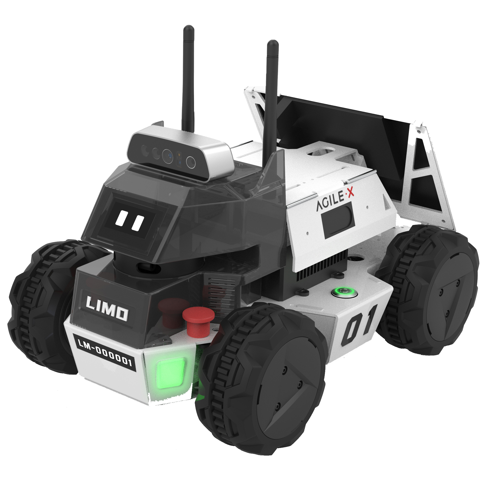

### Webgrafía:

* [TheConstruct: Build Your First ROS2 Based Robot](https://www.robotigniteacademy.com/courses/309)
* [Repositorio LIMO (GitHub)](https://github.com/agilexrobotics/limo_ros2/tree/humble)
* [Manual de usuario LIMO (Foxy)](https://github.com/agilexrobotics/limo_pro_doc/blob/master/Limo%20Pro%20Ros2%20Foxy%20user%20manual%28EN%29.md)
* [Bitbucket LIMO (TheConstruct)](https://bitbucket.org/theconstructcore/limo_robot/src/main/)
* [Proyectos ROB (TheConstruct Bitbucket)](https://bitbucket.org/theconstructcore/workspace/projects/ROB)
* [Imagen Docker TheConstruct Humble-v3](https://hub.docker.com/r/theconstructai/limo/tags)
* [Repositorio Odometry Control - ROS2](https://github.com/AntoBrandi/Self-Driving-and-ROS-2-Learn-by-Doing-Odometry-Control/tree/main)
* [Repositorio Odometry Control - ROS1](https://github.com/AntoBrandi/Self-Driving-and-ROS-Learn-by-Doing-Odometry-Control)
* [Repositorio Arduino-Bot (humble)](https://github.com/AntoBrandi/Arduino-Bot/tree/humble)

---

## **1. Configuración del proyecto del robot en entorno virtual para simulación**

### a) Simulación en TheConstruct

Utilizando la interfaz de TheConstruct, clona el siguiente repositorio:

```bash
git clone https://github.com/Mattyete/ROS2_LIMO_ws.git
cd ROS2_LIMO_ws
colcon build
source install/local_setup.bash
```

#### Añadir en `.bashrc` las siguientes líneas:

```bash
export ROS_DOMAIN_ID=0
export TURTLEBOT3_MODEL=waffle
export RMW_IMPLEMENTATION=rmw_cyclonedds_cpp
export GAZEBO_MODEL_PATH=/home/user/ROS2_LIMO_ws/src/my_robot_bringup/models:$GAZEBO_MODEL_PATH
source /opt/ros/humble/setup.bash
source /usr/share/colcon_argcomplete/hook/colcon-argcomplete.bash
source /home/user/ROS2_LIMO_ws/install/setup.bash
cd /home/user/ROS2_LIMO_ws
```

#### Si aparecen advertencias sobre `setuptools`:

```bash
sudo apt install python3-pip
pip3 list | grep setuptools
pip3 install setuptools==58.2.0
```

#### Si aparecen advertencias sobre `PREFIX_PATH`:

```bash
unset COLCON_PREFIX_PATH
unset AMENT_PREFIX_PATH
unset CMAKE_PREFIX_PATH
cd ~/ROS2_LIMO_ws
rm -rf build/ install/ log/
colcon build
```

Abre una nueva terminal para que se vuelva a leer el `.bashrc`.

---

## **2. Configuración del proyecto del robot para control real**

Aquí se revisa el ordenador embarcado usado en el robot y el proceso de configuración diseñado.

La instalación se basa en un Docker personalizado para integrarse correctamente con ROS2.

### **2.1. Configuración del robot LIMO**

* Ordenador Jetson Nano embarcado.
* Uso de `Dockerfile` y `docker-compose` personalizados.

Cuando el robot LIMO se conecta, se ejecuta el servicio definido en `docker-compose-v3.yaml` y el robot queda listo para ser controlado desde TheConstruct.

Si falla el docker-compose-v3.yaml, parar el contenedor y seguir los pasos que están en https://hub.docker.com/r/theconstructai/limo. (Aplicar lo mismo pero con el archivo docker-compose-v3.yaml)

#### Desde un PC en la misma red:

* Conéctate por SSH con VSCode.
* Verifica los contenedores activos.
* Abre una nueva ventana de VSCode adjunta al contenedor LIMO.
* Para ver los tópicos de ROS:

```bash
source /limo_entrypoint-v3.sh
ros2 topic list
```

#### Desde el servicio RRL de TheConstruct:

* Instala en tu cuenta el robot LIMO.
* Conéctate al robot y en una nueva terminal escribe:

```bash
ros2 topic list
```

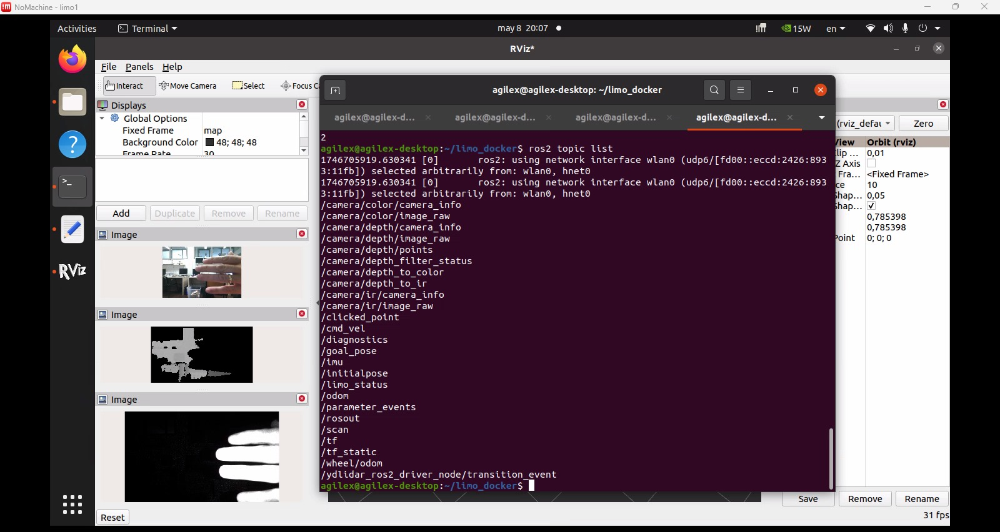

# **USO de ROS2 LIMO**
## **USO de SelfControl y Wallfollower**
### **Entorno simulado (TheConstruct)**
Para lanzar el bringup del robot en simulación, abre una terminal y ejecuta:
```bash
ros2 launch my_robot_bringup my_robot_bringup_sw.launch.xml use_sim_time:=True x0:=1.0 y0:=1.0 yaw0:=1.8 custom_world:=square3m_walls.world
```

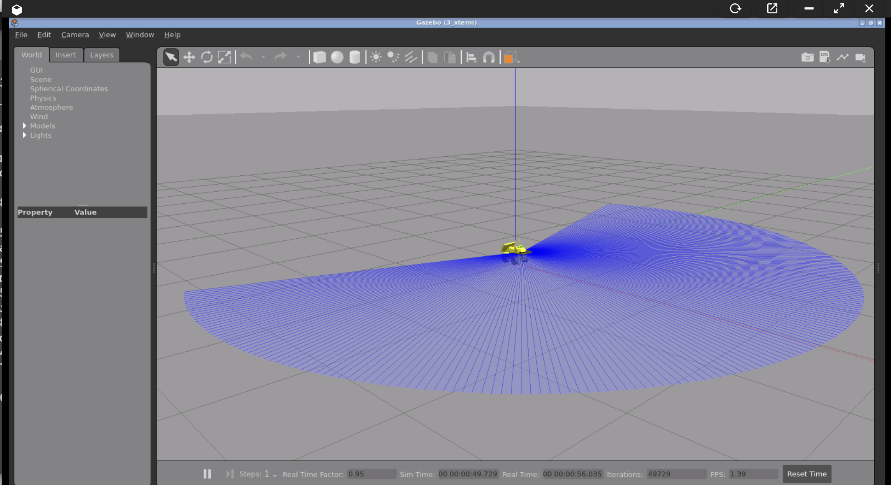

Luego, abre una nueva terminal y ejecuta el nodo de evitación de obstáculos:
```bash
ros2 launch my_robot_control my_robot_selfcontrol_LIMO.launch.xml time_to_stop:=10.0
```

Para lanzar el nodo de seguimiento de paredes en lugar del anterior:
```bash
ros2 launch my_robot_control my_robot_wallfollower_LIMO.launch.xml time_to_stop:=10.0
```

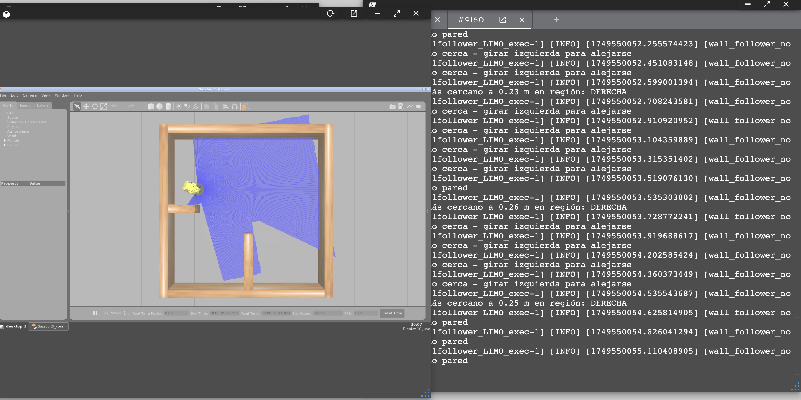

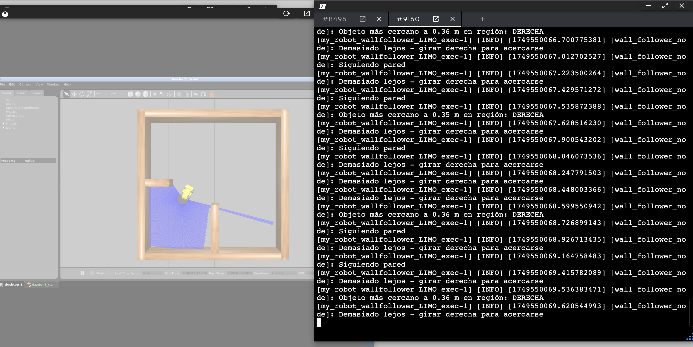

### **Entorno real**
Para el entorno real, el bringup ya se ejecuta automáticamente al encender el robot gracias al docker-compose-v3.yaml, por lo que solo debes lanzar los nodos de control desde una terminal (conectándote vía VSCode al contenedor ROS o mediante TheConstruct):

Evitación de obstáculos:
```bash
ros2 launch my_robot_control my_robot_selfcontrol_LIMO.launch.xml time_to_stop:=10.0
```

Seguimiento de paredes:
```bash
ros2 launch my_robot_control my_robot_wallfollower_LIMO.launch.xml time_to_stop:=10.0
```

## **USO DE SLAM Y NAVEGACIÓN CON ROS2 EN EL ROBOT LIMO**

### **Generación de mapa (SLAM)**

### **Entorno simulado (TheConstruct)**

Ejecuta el bringup del robot en el mundo virtual:
```bash
ros2 launch my_robot_bringup my_robot_bringup_sw.launch.xml use_sim_time:=True x0:=0.5 y0:=-1.5 yaw0:=1.57 custom_world:=square4m_sign.world
```

En otra terminal, mueve el robot manualmente:
```bash
ros2 run teleop_twist_keyboard teleop_twist_keyboard
```

En una tercera terminal, lanza el nodo de SLAM con Cartographer:
```bash
ros2 launch my_robot_cartographer cartographer.launch.py use_sim_time:=True
```

Cuando hayas recorrido suficiente espacio, guarda el mapa:
```bash
cd src/Navigation_Projects/my_robot_navigation2/map/
ros2 run nav2_map_server map_saver_cli -f my_map
```

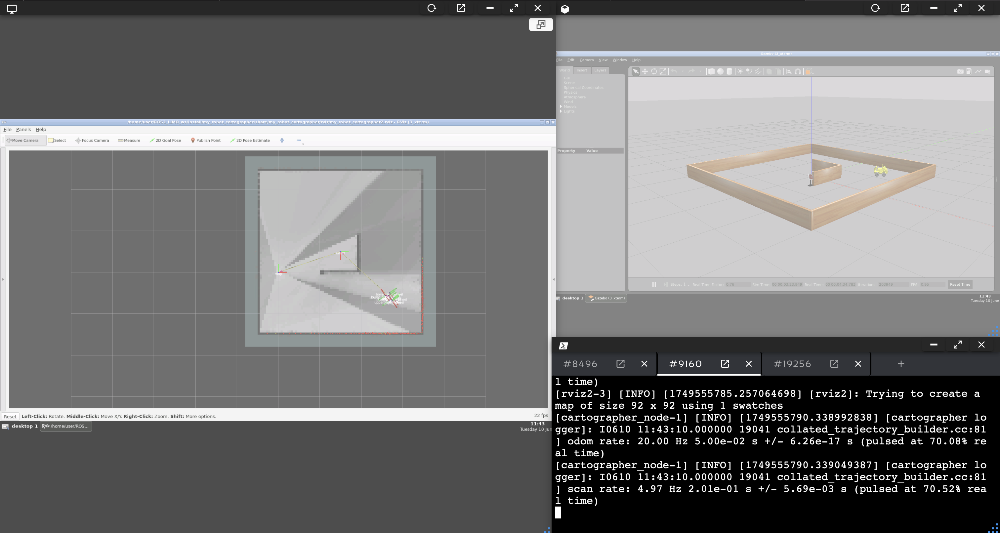

### **Entorno real**

Al encender el robot, el bringup ya se lanza automáticamente por docker-compose.
Ejecuta el nodo de Cartographer (sin use_sim_time):

```bash
ros2 launch my_robot_cartographer cartographer.launch.py use_sim_time:=False
```

Guarda el mapa como se ha indicado arriba.

### **Navegación sobre el mapa guardado**

### **Entorno simulado (TheConstruct)**

Lanza el bringup:
```bash
ros2 launch my_robot_bringup my_robot_bringup_sw.launch.xml use_sim_time:=True x0:=0.5 y0:=-1.5 yaw0:=1.57 custom_world:=square4m_sign.world
```

En una nueva terminal, lanza la navegación con el mapa y el archivo de configuración del LIMO:
```bash
ros2 launch my_robot_navigation2 navigation2_robot.launch.py use_sim_time:=True map:=map_square4m_sign.yaml param:=limo_sw.yaml
```

Si deseas priorizar los datos del LIDAR sobre los de odometría, usa limo_sw_lidar.yaml en lugar de limo_sw.yaml.

### **Entorno real**

Asegúrate de tener el archivo limo_real.yaml con base_frame_id: "odom".
Lanza la navegación:
```bash
ros2 launch my_robot_navigation2 navigation2_robot.launch.py use_sim_time:=False map:=map_square4m_sign.yaml param:=limo_real.yaml
```

Usa "2D Pose Estimate" en RViz para localizar al robot en el mapa. Una vez hecho, podrás enviar objetivos de navegación.

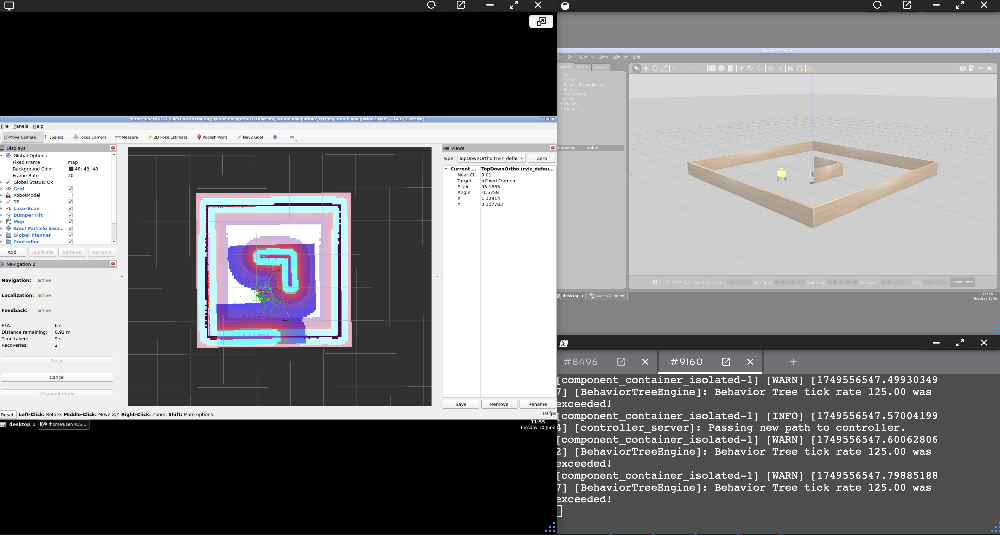

### **Navegación programática con Simple Commander**

Lanza el nodo de navegación:
### **Entorno simulado (TheConstruct)**

Lanza el bringup del LIMO:
```bash
ros2 launch my_robot_bringup my_robot_bringup_sw.launch.xml use_sim_time:=True x0:=0.5 y0:=-1.5 yaw0:=1.57 custom_world:=square4m_sign.world
```

En una nueva terminal:
```bash
ros2 launch my_robot_navigation2 navigation2_robot.launch.py use_sim_time:=True map:=map_square4m_sign.yaml param:=limo_sw.yaml
```

### **Entorno real**
```bash
ros2 launch my_robot_navigation2 navigation2_robot.launch.py use_sim_time:=False map:=map_square4m_sign.yaml param:=limo_real.yaml
```

Ejecuta el script para enviar la posición inicial y waypoints:
```bash
ros2 run my_robot_nav_control nav_target0_exec
```

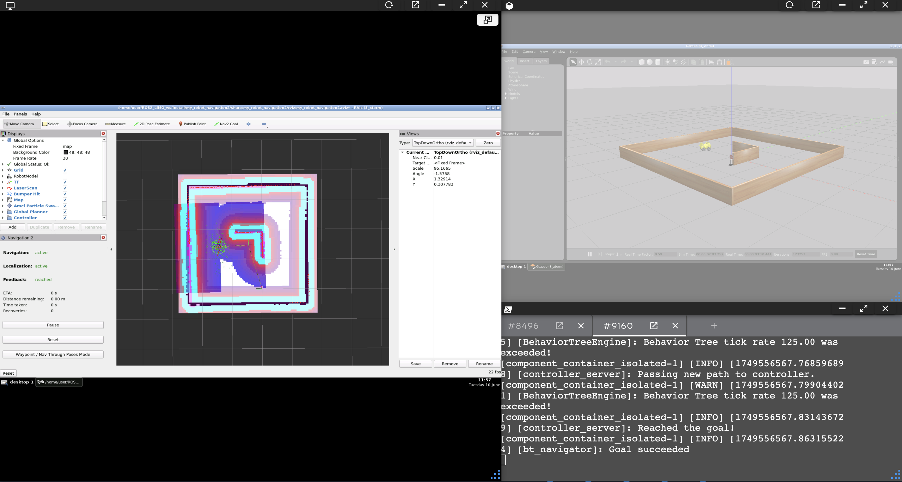

## **PROYECTO BASADO EN EL RECONOCIMIENTO DE OBJETOS (KERAS)**
Se describe un método basado en Visión Artificial para identificar señales de tráfico.

### Instalación de paquetes ROS necesarios

Instrucciones para instalar los paquetes requeridos:
```bash
sudo apt update
sudo apt install python3-pip
sudo apt install python3-opencv
pip3 install numpy matplotlib
pip3 install keras tensorflow
sudo apt install ros-humble-cv-bridge
```

Si usasemos Keras, que es una API de alto nivel que se ejecuta sobre TensorFlow.

### Pasos

1. **Encendido del LIMO**: el bringup se lanza automáticamente al encender el robot.

2. **Colocar el LIMO frente a una señal de tráfico**.

3. **Tomar fotos desde la cámara**:
```bash
ros2 run my_robot_AI_identification take_photo_exec
```

Se puede usar esta versión más avanzada que toma fotos de forma continua, incluye datos en el nombre del archivo para generar el modelo y detecta señales de tráfico cuando el modelo ya ha sido creado:
```bash
ros2 run my_robot_AI_identification takePhoto_detectSign_keras_exec
```

4. **Abrir RVIZ para ver la imagen de la cámara**:
```bash
rviz2
```

5. **Crear el modelo con Teachable Machine**:
Accede a https://teachablemachine.withgoogle.com/, selecciona "Get Started", luego "Image Project", y elige "Standard Image Model".

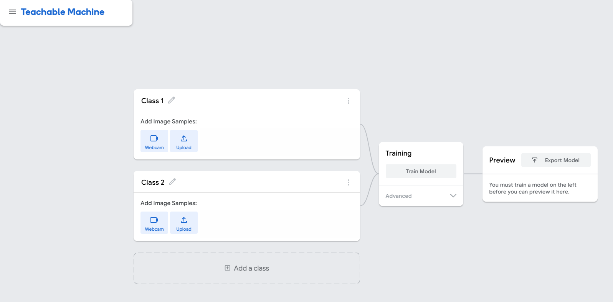

6. **Recoger imágenes con la cámara del LIMO** para cada señal y súbelas al proyecto.

7. **Entrenar el modelo** y exportarlo como archivo `.h5` de Keras. El modelo se guarda en la carpeta `models`.

8. **Verificar los tópicos (en TheConstruct)**:
```bash
ros2 topic list
```
Asegúrate de que el tópico `/camera/color/image_raw` esté correctamente configurado en el archivo `takePhoto_detectSign_keras.py`.

9. **Lanzar el nodo de clasificación y toma de fotos**:
```bash
ros2 launch my_robot_AI_identification takePhoto_detectSign_keras.launch.py
```

10. **Detener la toma de fotos** (en nueva terminal):
```bash
ros2 topic pub /capture_toggle std_msgs/Bool "data: false"
```
Para reanudar la toma de fotos:
```bash
ros2 topic pub /capture_toggle std_msgs/Bool "data: true"
```

## **PROYECTO BASADO EN EL RECONOCIMIENTO DE SEÑALES (YOLO)**

Se describe un método basado en visión artificial para identificar señales de tráfico utilizando YOLO.

## Entrenamiento de modelos
- https://roboflow.com/
- https://github.com/ultralytics/ultralytics
- https://docs.ultralytics.com/es/usage/python/#how-do-i-train-a-custom-yolo-model-using-my-dataset

En este proyecto hemos creado un paquete llamado `my_robot_ai_identification` donde se han utilizado dos estrategias para identificar señales:
- Keras con TensorFlow (Explicado anteriormente)
- YOLO

## 1. Instalación de paquetes ROS2

Para YOLO, basta con instalar `ultralytics` en el entorno ROS2 Humble:
```bash
pip install ultralytics
pip3 uninstall numpy
pip3 install "numpy<2.0"
```

## 2. Navegación del Robot

Primero hay que lanzar el bringup y navegar del punto inicial al objetivo.

- Lanzar el robot:
    - En simulación:
    ```bash
    ros2 launch my_robot_bringup my_robot_bringup_sw.launch.xml use_sim_time:=True x0:=0.5 y0:=-1.5 yaw0:=1.57 custom_world:=square4m_sign.world
    ```
    > Asegúrate de que haya una señal de tráfico en el mundo. Puedes cambiar el modelo de la señal en la línea 30 del mundo.

    - En el robot real LIMO, el bringup ya se ejecuta automáticamente.

- Generar un mapa:
    - En simulación:
    ```bash
    ros2 launch my_robot_cartographer cartographer.launch.py use_sim_time:=True
    ```
    - En el robot real:
    ```bash
    ros2 launch my_robot_cartographer cartographer.launch.py use_sim_time=False
    ```

    - Guardar el mapa:
    ```bash
    cd src/Navigation_Projects/my_robot_navigation2/map/
    ros2 run nav2_map_server map_saver_cli -f my_map_yolo
    ```

- Navegar usando el mapa:
    - En simulación:
    ```bash
    ros2 launch my_robot_navigation2 navigation2_robot.launch.py use_sim_time=True map:=map_square4m_sign.yaml param:=limo_sw.yaml
    ```
    > Para priorizar el LIDAR sobre la odometría usa `limo_sw_lidar.yaml`

    - En entorno real:
        - Usar el archivo `limo_real.yaml` en la carpeta `param` con `base_frame_id: "odom"`
        ```bash
        ros2 launch my_robot_navigation2 navigation2_robot.launch.py use_sim_time=False map:=map_square4m_sign.yaml param:=limo_real.yaml
        ```

## 3. Entrenamiento del Modelo

Usaremos Roboflow:
1. Accede a https://roboflow.com/
2. Inicia sesión con Google
3. Crea un espacio de trabajo (ej. TrafficSignals)
4. Crea un nuevo proyecto de tipo "Object Detection"
5. Sube las imágenes de las señales (stop, izquierda, derecha, etc.)
6. Etiqueta las imágenes y distribuye el trabajo entre compañeros
7. Entrena el modelo
8. Exporta el conjunto en formato YOLOv8 y descarga el `.zip`

## 4. Predicción de señales

### En TheConstruct:
1. Entrena el modelo con los datos de Roboflow (Picture_prediction_yolo.py):
```python
from ultralytics import YOLO

model = YOLO("yolov8n.pt")
train_results = model.train(
    data="data.yaml",
    epochs=20,
    imgsz=640,
    device="cpu",
)
metrics = model.val()
results = model("src/AI_Projects/my_robot_ai_identification/photos/Forbidden/Foto_5.jpg")
results[0].show()
model.save("yolov8n_custom.pt")
path = model.export(format="onnx")
```

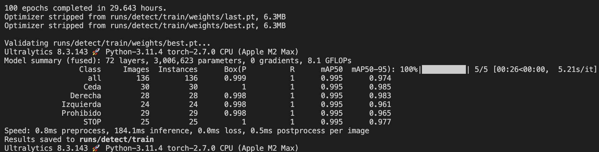

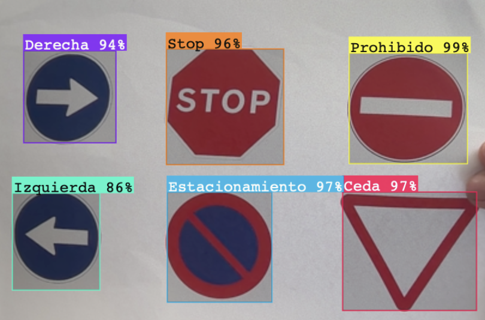

2. Usar el modelo entrenado para predecir (Model_training_yolo.py):
```python
from ultralytics import YOLO
model = YOLO("yolov8n_custom.pt")
results = model("src/AI_Projects/my_robot_ai_identification/photos/Forbidden/Foto_5.jpg")
results[0].show()
```

3. Para pruebas:
    - Imagen: `picture_prediction_yolo.py`
    - Vídeo en directo: `rt_prediction_yolo.py`

### En simulación:
```bash
ros2 run my_robot_ai_identification rt_prediction_yolo_exec
```

### En entorno real (LIMO):
```bash
apt update
apt install python3-pip git python3-colcon-common-extensions build-essential
pip install ultralytics
pip3 uninstall numpy
pip3 install "numpy<2.0"
git clone https://github.com/Mattyete/ROS2_LIMO_ws.git
cd ROS2_LIMO_ws
colcon build
source install/setup.bash
ros2 run my_robot_ai_identification rt_prediction_yolo_exec
```

## 5. Actuación del robot tras la predicción

Una vez que el robot identifica la señal de tráfico, debe actuar en consecuencia a lo que detecte el robot, en caso de ser un STOP, para durante 3 segundos, en caso de ser un ceda disminuye la velocidad, etc.

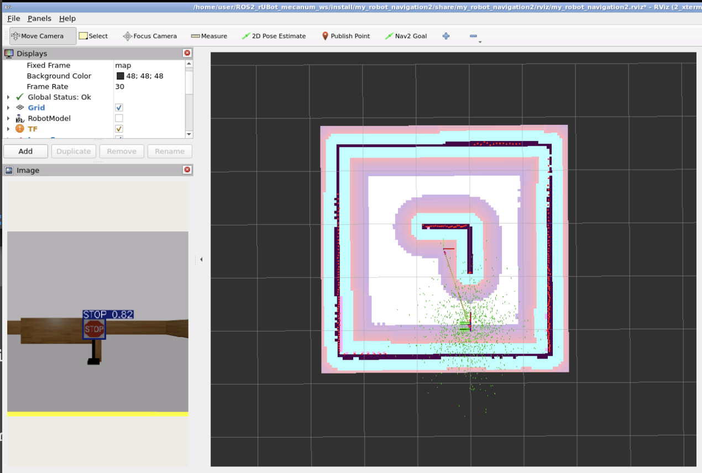
